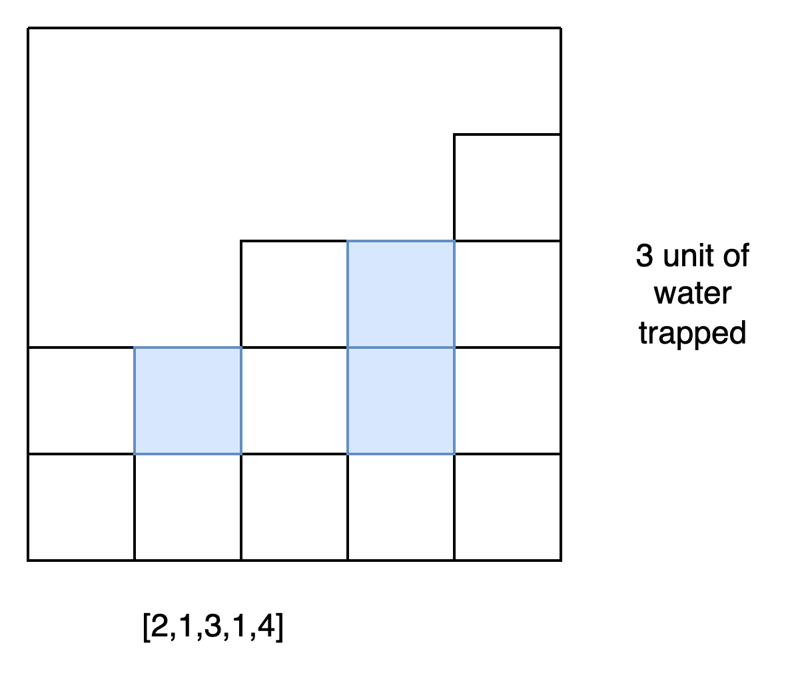
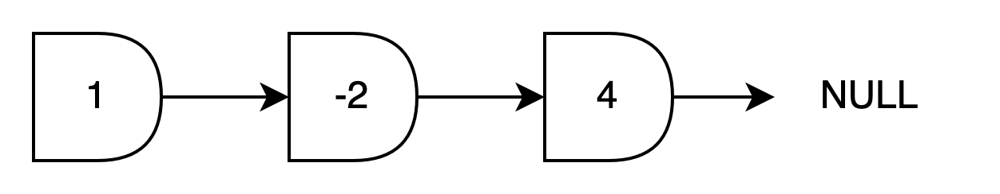
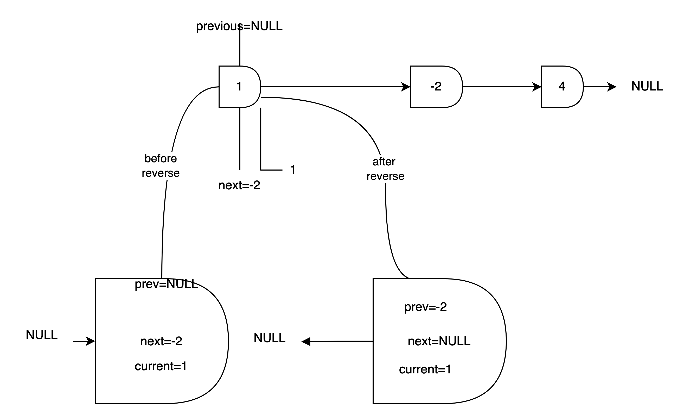
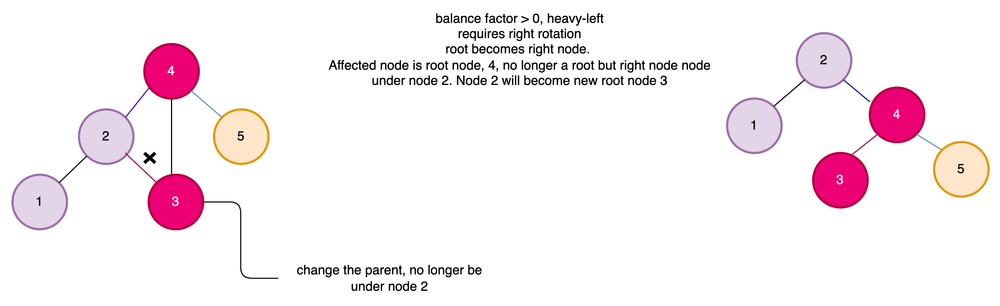
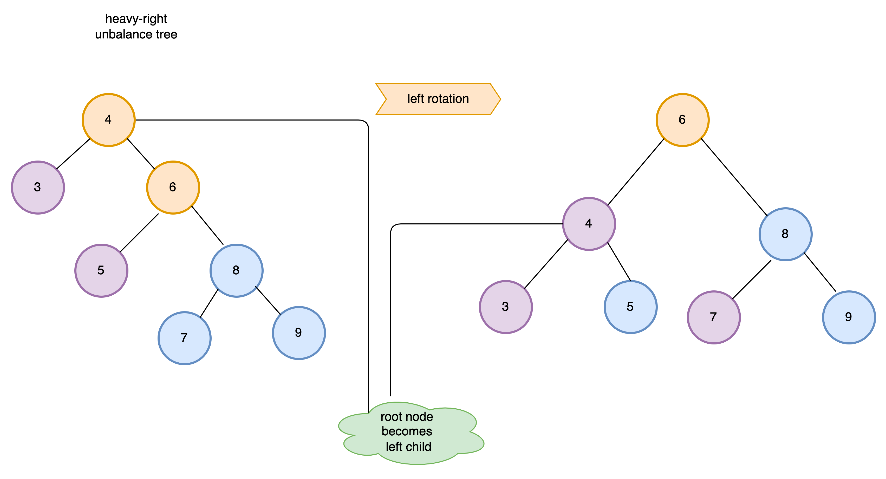
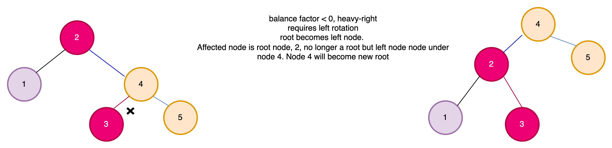
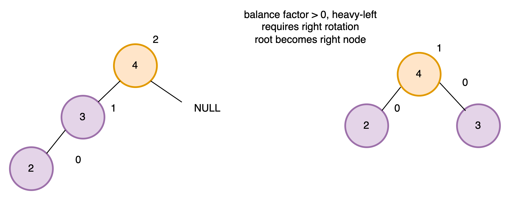
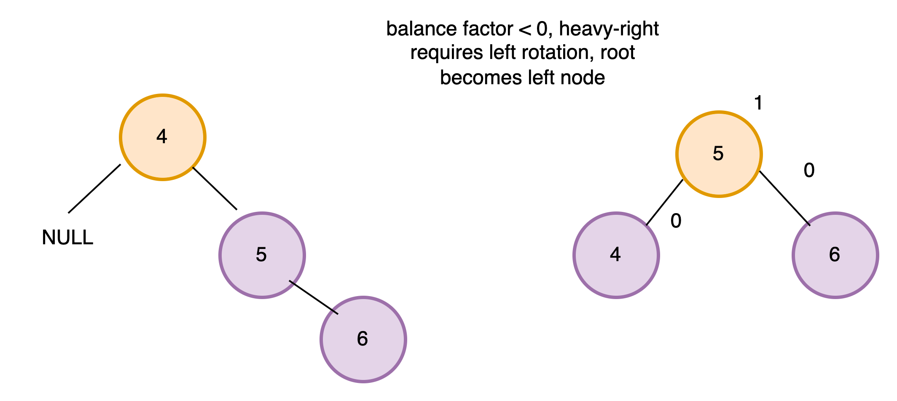
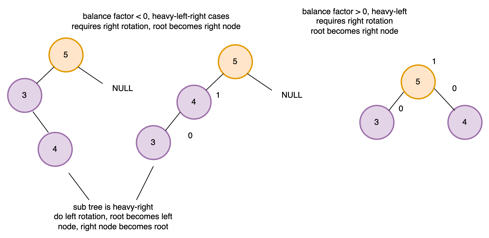
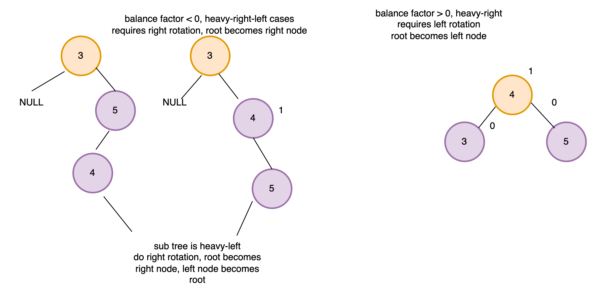

# Algo learning

## Reversing an array in-place

The problem is that we want to reverse a T[] array in O(N) linear time complexity
and we want the algorithm to be in-place as well - so no additional memory can be used!
For example: input is [1,2,3,4,5] then the output is [5,4,3,2,1]

## Trapping rain water problem overview

Given n non-negative integers representing an elevation map where the width of each bar is 1.
Compute how much water it can trap after raining!.
Here the elevation map (the input for the algorithm) is [4,1,3,1,5] and the output is the total units of trapped rain
water

- which is 7.
  Good luck!



## Linked Lists

> Huge advantage, can insert the item at the beginning of the data structure fast `- O(1) running time`
> Huge disadvantage, slow operation to insert items at the end `- O(N) running time`



> `array`, `linked list` and `doubly linked list` does not solve the problem to do arbitrary search with
> faster than O(N) running time complexity

# Interesting Topics

Compare the performance of `linkedlist` and `array` in python

`Result`

```text
time to insert 500000 item into array is 55.26879405975342
time to insert 500000 item into linkedlist is 0.7220067977905273
ratio 76.54885553555177
```

# Finding the middle node in a linked list

Suppose we have a standard linked list. Construct an in-place (without extra memory)
algorithm thats able to find the middle node!
> implement two pointers to traverse the nodes, one with pace 1, another one with pace 2. When the fast pointer reaches
> the
> the last node it means the slow pointer reaches the middle node

# Construct an in-place algorithm to reverse a linked list!



```python
    def reverse(self):
    # In the beginning set to head
    current = self.head
    # In the beginning set to NULL
    next = None
    # In the beginning set to NULL
    prev = None

    # 1->2->3->4 to be 1<-2<-3<-4
    while current:
        # This is to point to the old next node of current node
        next = current.next_node
        # the current node's next node point to the node that in the beginning it pointed by
        # if current node is head, then this is NULL, call it prev
        current.next_node = prev

        # prev is pointer updated with current, in the next iteration it will be pointed by node after
        prev = current
        # current is pointer updated with next, in the next iteration it will be pointing to prev
        current = next

    self.head = prev
```

# How to implement the queue with 2 stacks

# How to implement the queue with 1 stacks

# Binary Search Tree

# Compare binary trees overview

Write an efficient algorithm thats able to compare two binary search trees. The method returns true if the trees are
identical
(same topology with same values in the nodes) otherwise it returns false.

# AVL Trees

## Term

* Balance factor

> hleft -hright

* heavy-left case

> Balance factor > 0 ,Requires right rotation
> Sample,





* heavy-right case

> Balance factor < 0, Requires left rotation



## AVL Trees Rotations

* Rotation case 1



* Rotation case 2



* Rotation case 3



* Rotation case 4



# Sorting Algorithm
Checking if an array is sorted or not...
Compare the adjacent element, from left to right, if the left is less then the right then it is sorted
otherwise it is not sorted. In code it looks like this,

```python
def is_sorted(self):
   """
        The operation has order O(N) running time complexity
        It will stop and return False if it is found the left element is greater
        than its adjacent right element
        :return:
    """
    for i in range(len(self.nums) - 1):
            if self.nums[i] > self.nums[i + 1]:
                return False
    return True
```

## Bubble Sort

## Bogo Sort

## Selection Sort
* O(N) -> write

## Merge Sort

## Insert Sort
>Compare all items with the preceeding items
* More write
* O(N2) -> write


## Shell Sort
>Not popular