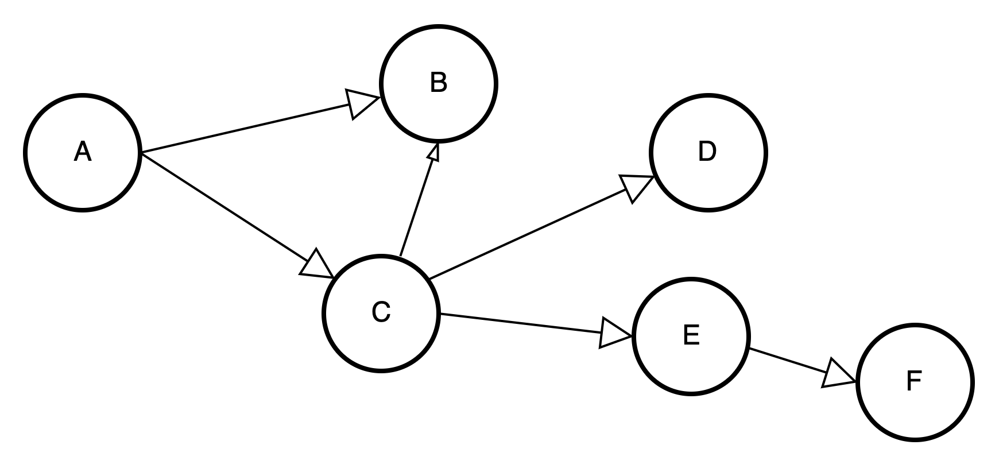

# Algo learning

## Reversing an array in-place

The problem is that we want to reverse a T[] array in O(N) linear time complexity
and we want the algorithm to be in-place as well - so no additional memory can be used!
For example: input is [1,2,3,4,5] then the output is [5,4,3,2,1]

## Trapping rain water problem overview

Given n non-negative integers representing an elevation map where the width of each bar is 1.
Compute how much water it can trap after raining!.
Here the elevation map (the input for the algorithm) is [4,1,3,1,5] and the output is the total units of trapped rain
water

- which is 7.
  Good luck!


## Linked Lists

> Huge advantage, can insert the item at the beginning of the data structure fast `- O(1) running time`
> Huge disadvantage, slow operation to insert items at the end `- O(N) running time`


> `array`, `linked list` and `doubly linked list` does not solve the problem to do arbitrary search with
> faster than O(N) running time complexity

# Interesting Topics

Compare the performance of `linkedlist` and `array` in python

`Result`

```text
time to insert 500000 item into array is 55.26879405975342
time to insert 500000 item into linkedlist is 0.7220067977905273
ratio 76.54885553555177
```

# Finding the middle node in a linked list

Suppose we have a standard linked list. Construct an in-place (without extra memory)
algorithm thats able to find the middle node!
> implement two pointers to traverse the nodes, one with pace 1, another one with pace 2. When the fast pointer reaches
> the
> the last node it means the slow pointer reaches the middle node

# Construct an in-place algorithm to reverse a linked list!


```python
    def reverse(self):
    # In the beginning set to head
    current = self.head
    # In the beginning set to NULL
    next = None
    # In the beginning set to NULL
    prev = None

    # 1->2->3->4 to be 1<-2<-3<-4
    while current:
        # This is to point to the old next node of current node
        next = current.next_node
        # the current node's next node point to the node that in the beginning it pointed by
        # if current node is head, then this is NULL, call it prev
        current.next_node = prev

        # prev is pointer updated with current, in the next iteration it will be pointed by node after
        prev = current
        # current is pointer updated with next, in the next iteration it will be pointing to prev
        current = next

    self.head = prev
```

# How to implement the queue with 2 stacks

# How to implement the queue with 1 stacks

# Binary Search Tree

# Compare binary trees overview

Write an efficient algorithm thats able to compare two binary search trees. The method returns true if the trees are
identical
(same topology with same values in the nodes) otherwise it returns false.

# AVL Trees

## Term

* Balance factor

> hleft -hright

* heavy-left case

> Balance factor > 0 ,Requires right rotation
> Sample,


* heavy-right case

> Balance factor < 0, Requires left rotation


## AVL Trees Rotations

* Rotation case 1


* Rotation case 2


* Rotation case 3


* Rotation case 4


# Sorting Algorithm
Checking if an array is sorted or not...
Compare the adjacent element, from left to right, if the left is less then the right then it is sorted
otherwise it is not sorted. In code it looks like this,

```python
def is_sorted(self):
   """
        The operation has order O(N) running time complexity
        It will stop and return False if it is found the left element is greater
        than its adjacent right element
        :return:
    """
    for i in range(len(self.nums) - 1):
            if self.nums[i] > self.nums[i + 1]:
                return False
    return True
```

## Bubble Sort

## Bogo Sort

## Selection Sort
* O(N) -> write

## Merge Sort

## Insert Sort
>Compare all items with the preceeding items
* More write
* O(N2) -> write


## Shell Sort
>Not popular

## Quick Sort
>Divide and Conquer
> Worst case O(N2)
> Average O(NlogN)

# Graph Theory
By definition, `Graph` is a mathematical structures used to `model pairwise relations between objects`


Given, **G(V,E)** graphs are made up of `V` nodes (vertices) that are connected by `E` edges (links)

**Undirected Graphs**
>Bidirectional where edge (v,u) is identical to the edge (u,v)

**Directed Graphs**
> a directed graph **G(V,E) is a set of vertices and edges have direction. 
It means that edge **(u,v)** is not identical to the edge **(v,u)**

## Graph Types

**trees**

is an undirected graph where any two vertices (nodes) are connected by exactly one path


**forests**

forest is an undirected graph, all of whose connected components are trees (disjoint union of trees)


**directed acyclic graph (dag)**
it is a finite directed graph with no directed cycles (crucial in many algorithms)



**complete graph (dag)**
every single pair of vertices (nodes) are connected


## Breadth-first Search

Assume a graph as below,


* we have a graph and we want to visit every node: we can do it with **BFS**
* the aim us to visit every vertex exactly once
* so the algorithm visits the neighbors then the neighbors of these neighbors of 
these new vertices until all nodes are visited
* running time complexity: **O(V+E)**
* memory complexity is not good: we have to store lots of references
* that is why **depth-first search (DFS)** is usually preferred
* the advantage is that it constructs a shortest path: **Dijkstra's algorithm** does a breadth-first search
if all the edge weights are equal to **1**

`Further on rabbit hole`

The underlying data type is **queue**
>We have an empty queue at the beginning and we keep checking whether we have visited the given node or not

>Algorithm keeps checking until queue is not empty

Given a graph as below


* step 1: Decide the starting vertex. Eg. node A
* step 2: Insert A into queue
* step 3: Dequeue will return A
* step 4: Set A with `visited=true`
* step 5: next is insert all neighbors to queue, B, F and G
* step 6: dequeue returns `B`
* step 7: set B as visited=true
* step 8: insert all its neighbors that have not visited yet into the queue. So C and D are enqueued
* step 9: repeat from step 6, where now, dequeue returns F

## Depth-First Search (DFS)
* `depth-first search` is widely used graph traversal algorithm besides breadth-first search.
* it was investigated as strategy for solving mazes by Tremaux in the 19th century
* the algorithm explores as far as possible along each branch before backtracking 
(on the other hand BFS is layer by layer algorithm)
* time complexity of traversing a graph with depth-first search: **O(V+E)**
* memory complexity: a bit better than that of BFS!!

`Implementation`

### recursion
>more compact
### iteration
>similar to BFS but it is using stack instead of queue
* step 1: Decide the starting vertex. Eg. node A
* step 2: Push A into stack
* step 3: Pop will return A
* step 4: Set A with `visited=true`
* step 5: next is insert all neighbors to queue, B, F and G
* step 6: Pop returns `G`
* step 7: set G as visited=true
* step 8: insert all its neighbors that 
have not visited yet into the stack. So H is pushed
* step 9: repeat from step 6, where now, dequeue returns H

## Real Problem Graph Theory


## using BFS to find a way out of a Maze

Your task is to design an algorithms with **breadth-first search** 
that is able to find the shortest path from a given source to a given destination. 
The maze is represented by a two-dimensional list.
```text
[
   [S, 1, 1, 1, 1],
   [0, 1, 1, 1, 1],
   [0, 0, 0, 0, 1],
   [1, 0, 1, 1, 1],
   [0, 0, 0, 1, D]
]
```
The **(0,0)** is the source and **(4,4)** is the destination. 
0 represents walls or obstacles and 1 is the valid cells we can include in the solution.

`Overview`


From the starting point, **(x, y)**, the possible move is,
* UP, increase by **(0, -1)**
* DOWN, increase by **(0, 1)**
* RIGHT, increase by **(1, 0)**
* LEFT, increase by **(-1, 0)**

`Different Route`


## Implementation

* Initialize the maze with the visited status

```text
[
 [False, False, False, False],
 [False, False, False, False],
 [False, False, False, False],
 [False, False, False, False]
]
```
`How the BFS works for the maze problem`

```python
 def search(self, i, j, destination_x, destination_y):
        """
        This the BFS implementation
        :param i: is the initial x position
        :param j: is the initial y position
        :param destination_x: is the destination x position
        :param destination_y: is the destination y position
        :return:
        """
        self.visited[i][j] = True

        queue = deque()
        # 1. initial distance is 0
        # 2. i,j is initial position for x and y
        queue.append((i, j, 0))
        # 3. Continue the iteration while the queue is not empty
        while queue:
            # 4. Get the fist item inserted into the queue
            (i, j, dist) = queue.popleft()
            # 5.  check if we reach the destination
            if i == destination_x and j == destination_y:
                # 6.  update the min distance with the updated one
                self.min_distance = dist
                # 7.  means the algorithm will stop
                break
            # 8. In case this is not yet in the destination we have to make a given mode
            # possible move, UP, DOWN, LEFT, RIGHT
            for move in range(len(self.move_x)):
                # try RIGHT,UP,DOWN,LEFT
                next_x, next_y = i + self.move_x[move], j + self.move_y[move]
                # 9. For all possible move check if it is valid
                if self.is_valid(next_x, next_y):
                    # 10. in case it is a valid move, update the visited flag to True
                    self.visited[next_x][next_y] = True
                    # 11. push the updated position into the queue, with the updated minimum distance
                    # the object pushed into the queue is the tuple with structure
                    # (updated_x_loc,updated_y_loc,min_dist)
                    queue.append((next_x, next_y, dist + 1))
```

# Djikstra shortest part 


